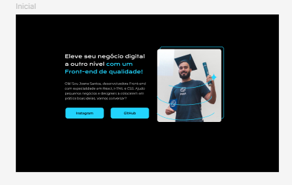
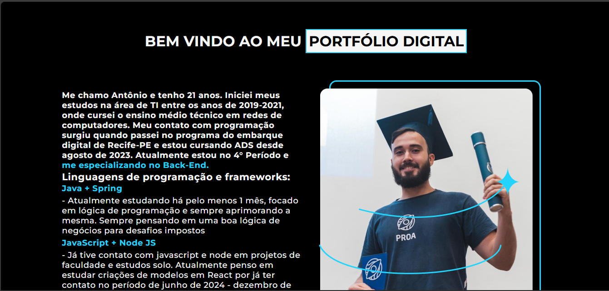
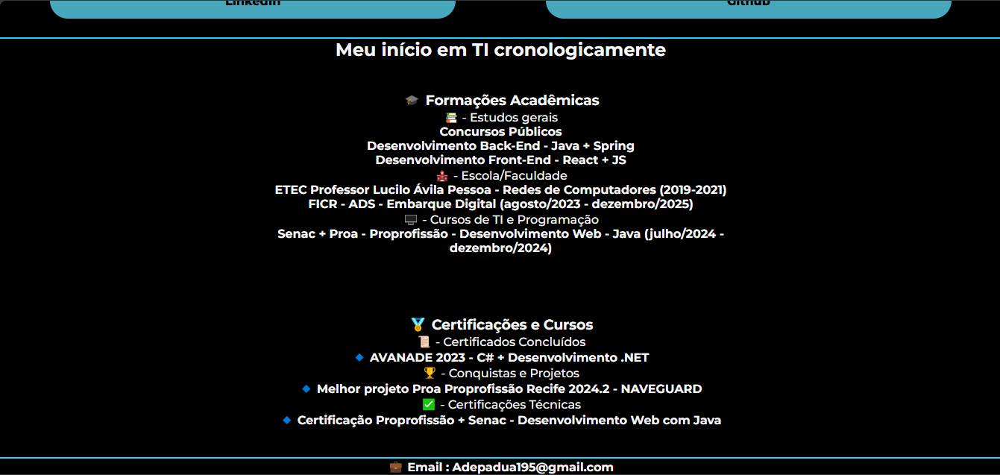
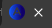

#Meu Portfólio 🚀

##Hello, folks! 👋

##Sejam muito bem-vindos ao meu portfólio!

##Sobre mim 💻

Minha jornada na tecnologia tem sido incrível! Durante minha participação no processo da Oracle Digital Innovation ONE, percebi que sempre há espaço para melhorar e estou constantemente em busca de evoluir. Atualmente, sou um desenvolvedor Back-End com um grande sonho: me tornar um Full-Stack Especialista, dominando com maestria os fundamentos do Back-End, especialmente com Java.

Para alcançar esse objetivo, estou sempre estudando a linguagem e aprimorando minhas habilidades sempre que possível. 📚✨

##Evolução e aprendizado 📈

Reconheço que ainda tenho dificuldades com teoria das cores e, às vezes, acabo complicando demais os designs das minhas criações. Mas isso não me impede de buscar melhorias! Sempre que tenho a oportunidade de realizar um curso que agregue mais conhecimento, eu aproveito ao máximo. 💡🎨

##Como tudo começou? 🤔

A ideia de criar este portfólio surgiu quando cheguei no módulo de CSS e HTML com a Rafa Ballerini e Guilherme Lima. Eles apresentaram um modelo de portfólio baseado no Figma, com cores que me chamaram bastante a atenção.

Inicialmente o projeto era assim:

 Então pensei:

"Por que não aprimorar esse projeto e contar um pouco da minha história, além de compartilhar alguns dos meus trabalhos?"

Foi assim que tudo começou! Durante o processo de criação, várias dúvidas e ideias foram surgindo, como:

E se eu colocar um botão para baixar meu currículo? 📄

E se eu contar minha história de forma dinâmica para quem quiser acompanhar? 📜

E assim fui moldando meu portfólio até chegar no que tenho hoje, sempre buscando melhorias! (Data da última atualização: 05/03/2025)

##Atualizações nas imagens serão realizadas aqui:

#Atualizações nas imagens 🖼️✨

Aqui você pode conferir as versões mais recentes do meu portfólio:

##🔹 Modelo mais atual: 05/03/25

##🔹 Agora com um favicon personalizado!🎨🔥

Agradecimentos 🙌

Quero deixar um agradecimento especial à Alura e à Oracle pelo programa ONE, que abriu meus olhos e me mostrou, na prática, a importância de um bom README e como desenvolver projetos com qualidade.

Agradeço também aos meus colegas, amigos e familiares que fizeram e fazem parte da minha jornada. Sem vocês, eu não estaria onde estou hoje. Mas sei que ainda tenho muito a melhorar, e essa jornada está apenas começando! Muito obrigado! 💙

#Quer falar comigo? 📬

Ficou interessado no meu projeto ou tem alguma dúvida? Entre em contato comigo pelas minhas redes sociais, que deixei disponíveis no próprio portfólio. 

link para acesso: Projeto em manutenção 🔧

"SEE YA TOMORROW!" 🚀
